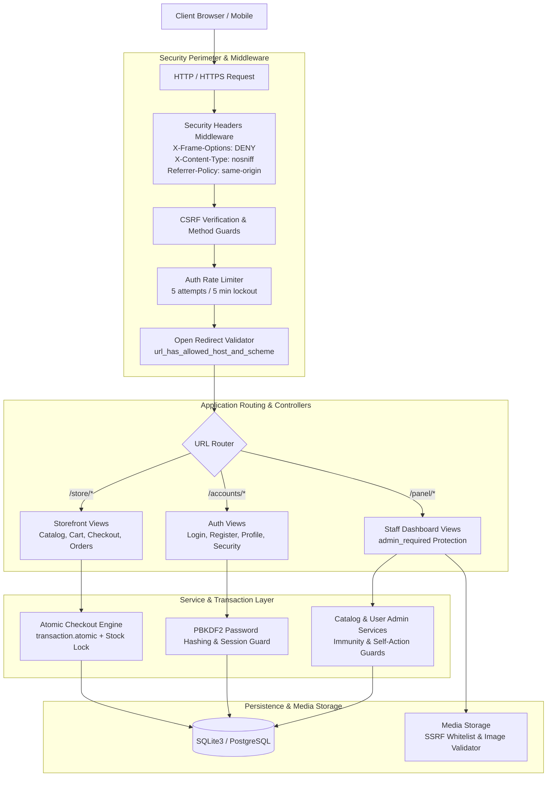

<div align="center">

# Aerixis ShopNow

**An Enterprise-Grade, Security-Hardened Full-Stack E-Commerce Engine**

A modern, robust e-commerce platform built with Django 4.2+, featuring atomic checkout transactions, defensive security controls aligned with the OWASP Top 10, and a dedicated staff administration dashboard.

---

[](https://python.org)
[](https://djangoproject.com)
[](https://sqlite.org)
[](test.py)
[](documentation.md#security-notes-owasp-top-10-protections-applied)
[](https://pep8.org)
[](LICENSE)

[Storefront](http://127.0.0.1:8000/) &bull; [Staff Control Panel](http://127.0.0.1:8000/panel/) &bull; [Architecture & Documentation](documentation.md) &bull; [Report Issue](https://github.com/anim-michael-asante/Aerixis-ShopNow/issues)

</div>

---

## Table of Contents

- [Project Overview](#project-overview)
- [Key Highlights](#key-highlights)
- [Visual Showcase](#visual-showcase)
- [System Architecture](#system-architecture)
- [Core Features](#core-features)
  - [Customer Storefront](#customer-storefront)
  - [Staff Control Panel](#staff-control-panel)
- [Security Architecture & OWASP Top 10](#security-architecture--owasp-top-10)
- [Tech Stack](#tech-stack)
- [Getting Started](#getting-started)
  - [Prerequisites](#prerequisites)
  - [Step-by-Step Installation](#step-by-step-installation)
  - [Environment Configuration](#environment-configuration)
  - [Database Setup and Seeding](#database-setup-and-seeding)
  - [Starting the Application](#starting-the-application)
- [Default Development Credentials](#default-development-credentials)
- [Automated Test Suite](#automated-test-suite)
- [Application Route Index](#application-route-index)
- [Repository Structure](#repository-structure)
- [Production Deployment Checklist](#production-deployment-checklist)
- [Contributing](#contributing)
- [License](#license)

---

## Project Overview

**Aerixis ShopNow** is an end-to-end digital commerce solution engineered with clean architectural patterns, robust concurrency management, and enterprise-grade defensive security. It solves the real-world operational challenges of e-commerce by providing:

1. **A Customer Experience**: Lightning-fast product discovery with dynamic filtering, cart persistence across sessions, atomic order dispatching, and self-service account management.
2. **A Staff Control Center**: A custom operations panel offering metrics, real-time revenue analytics, category hierarchy management, product lifecycle control, and order fulfillment state machines.
3. **Defense-in-Depth Security**: Hardened against all OWASP Top 10 vulnerabilities, including rate-limited authentication, SSRF-guarded media fetching, atomic transaction isolation, safe open-redirect handling, and strict role segregation.

---

## Key Highlights

- **Concurrency-Safe Checkout**: Order creation, inventory validation, stock decrement, and cart clearance execute inside a single atomic database transaction (`transaction.atomic`) to prevent race conditions and overselling.
- **Zero Client-Side Trust**: All pricing, stock constraints, permissions, and file uploads are strictly verified on the server.
- **Brute-Force Protection**: Built-in failed login throttling (5 failed attempts per IP within 5 minutes triggers a lockout window).
- **Hardened Open Redirect Protection**: All authentication redirect query parameters are sanitized through host-and-scheme validation.
- **Optimized Query Architecture**: Catalog and order queries utilize `select_related` and `prefetch_related` to eliminate N+1 database bottlenecks.
- **Comprehensive Test Coverage**: Includes 156 automated test assertions spanning security, transactions, state mutations, and access control.

---

## Visual Showcase

### Storefront Experience
The customer interface provides an intuitive shopping workflow with catalog filtering, real-time search, and product highlights.

<div align="center">
  
</div>

<br />

<div align="center">
  <table>
    <tr>
      <td align="center" width="50%">
        <strong>Responsive Mobile Layout</strong><br />
        
      </td>
      <td align="center" width="50%">
        <strong>Product Catalog & Filtering</strong><br />
        
      </td>
    </tr>
  </table>
</div>

### Staff Administration Dashboard
The staff panel equips administrators with store metrics, order processing controls, product catalogs, and user management.

<div align="center">
  
</div>

---

## System Architecture

The following diagram illustrates the request lifecycle, security filters, application services, and database layers:



---

## Core Features

### Customer Storefront
- **Search & Filtering**: Search by product name and description, filter by category and price range, and sort by popularity, date, or price.
- **Product Discovery**: Rich product detail pages displaying image galleries, specifications, stock availability status, and related items.
- **Cart Management**: Dynamic cart with client-side feedback and server-side stock boundary validation.
- **Resilient Checkout**: Transaction-safe ordering workflow collecting shipping details and assigning unique order tracking references.
- **Order Lifecycle Tracking**: Full historical review of past orders with real-time status badges (Pending, Processing, Shipped, Delivered, Cancelled).
- **Self-Service Profile**: Update profile details, bio, delivery phone, avatar uploads (strictly bounded to <= 2MB), and secure password changes.

### Staff Control Panel
- **Executive Analytics**: Key performance indicators including total revenue, order count, registered customer count, catalog volume, and low-stock alerts.
- **Product Lifecycle Management**: Create, edit, and delete products, manage inventory levels, configure pricing, upload media, or link external image URLs.
- **Category Hierarchy**: Organize inventory into structured categories with slug generation and visibility toggles.
- **Fulfillment Pipeline**: Manage orders through fulfillment stages (Pending -> Processing -> Shipped -> Delivered -> Cancelled) with cancellation inventory restoration.
- **User Governance**: View registered users, toggle active/staff statuses, and safely remove accounts with superuser immunity protection.

---

## Security Architecture & OWASP Top 10

Aerixis ShopNow enforces a defense-in-depth model across every tier of the application:

| OWASP Vulnerability | Threat Description | Aerixis ShopNow Defensive Countermeasure |
| :--- | :--- | :--- |
| **A01: Broken Access Control** | Unauthorized privilege escalation or data tampering | `admin_required` decorator validates `is_authenticated` and `is_staff`. Superuser accounts have deletion immunity. Users cannot delete or demote their own account. Orders are strictly scoped to the requesting user. |
| **A02: Cryptographic Failures** | Data in transit or rest exposure | Django PBKDF2 with SHA-256 password hashing. SSL/TLS headers ready (`SECURE_SSL_REDIRECT`, `SECURE_HSTS_SECONDS`, `SESSION_COOKIE_SECURE`, `CSRF_COOKIE_SECURE`). |
| **A03: Injection** | SQL injection and script injection | 100% parameterized queries via Django ORM. Django template auto-escaping neutralizes XSS. Zero raw SQL queries or dynamic shell executions. |
| **A04: Insecure Design** | Flawed business logic and race conditions | Concurrency-safe atomic checkout (`transaction.atomic`) ensures inventory cannot be oversold. State-mutating endpoints mandate POST requests (`@require_POST`). |
| **A05: Security Misconfiguration** | Insecure headers and exposed debug flags | Explicit security response headers: `X-Frame-Options: DENY`, `X-Content-Type-Options: nosniff`, `Referrer-Policy: same-origin`. Configuration externalized via `.env`. |
| **A06: Vulnerable Components** | Outdated or vulnerable third-party dependencies | Minimized attack surface: zero third-party Django plugins. Dependencies strictly pinned (`requirements.txt`). Continuous vulnerability audits via safety and pip-audit. |
| **A07: Identification & Auth** | Brute force, credential stuffing, open redirects | IP-based failed login rate-limiting (5 failures / 5 minutes = lockout). `url_has_allowed_host_and_scheme` sanitizes all post-login redirects. Password policy enforcement. |
| **A08: Software & Data Integrity** | Malicious file uploads or remote code execution | Uploaded image validation: MIME type check, Pillow integrity verification, file size bounded to <= 2MB. Stored files execute no code. |
| **A09: Logging & Monitoring** | Silent failures and unmonitored security events | Structured logging for security events (rate limit triggers, permission violations, SSRF blocks, failed checkout transactions). Zero passwords or tokens logged. |
| **A10: SSRF** | Internal infrastructure access via image URLs | Strict host whitelisting and protocol verification (`http`/`https` only). Private IP ranges (RFC 1918, loopbacks, link-local) are blocked before fetching. |

For detailed documentation on the security implementation, see [documentation.md](documentation.md#security-notes-owasp-top-10-protections-applied).

---

## Tech Stack

```text
Backend Framework:    Django 4.2 LTS (Python 3.10+)
Database Engine:      SQLite3 (Development) / PostgreSQL (Production ready)
Media Processing:     Pillow 10.0+
Frontend Layer:       Django HTML5 Templates, Semantic CSS3, Vanilla ES6 JavaScript
Typography:           Google Fonts (Inter)
Icons:                Font Awesome 6.5.0 / Lucide Architecture Guidelines
Architecture Pattern: Model-View-Template (MVT) with Service & Security Layers
Testing Framework:    Django TestCase / Unitest Runner (156 assertions)
```

---

## Getting Started

### Prerequisites

Ensure you have the following installed on your host system:
- **Python 3.10+**: `python --version`
- **pip**: `pip --version`
- **Git**: `git --version`

### Step-by-Step Installation

1. **Clone the repository**:
   ```bash
   git clone https://github.com/anim-michael-asante/Aerixis-ShopNow.git
   cd Aerixis-ShopNow
   ```

2. **Create and activate a virtual environment**:
   ```bash
   # Create virtual environment
   python -m venv .venv

   # Activate on Windows (PowerShell)
   .venv\Scripts\Activate.ps1

   # Activate on Windows (Command Prompt)
   .venv\Scripts\activate.bat

   # Activate on Linux / macOS
   source .venv/bin/activate
   ```

3. **Install dependencies**:
   ```bash
   pip install -r requirements.txt
   ```

### Environment Configuration

Copy the sample environment file and configure your local settings:

```bash
# Windows
copy .env.example .env

# Linux / macOS
cp .env.example .env
```

Key environment configuration variables in `.env`:

| Variable | Default Value | Description |
| :--- | :--- | :--- |
| `SECRET_KEY` | *(Set a random 50+ character string)* | Django cryptographic signing secret |
| `DEBUG` | `True` | Set to `False` in production environments |
| `ALLOWED_HOSTS` | `127.0.0.1,localhost` | Comma-separated list of permitted hostnames |
| `DATABASE_URL` | *(Optional)* | Database connection URI (for PostgreSQL deployment) |
| `SECURE_SSL_REDIRECT` | `False` | Enforce HTTPS redirection in production |

### Database Setup and Seeding

Apply database schema migrations and populate initial sample categories, products, and default accounts:

```bash
# Apply migrations
python manage.py makemigrations accounts store
python manage.py migrate

# Seed catalog, categories, orders, and administrative accounts
python manage.py seed_data
```

### Starting the Application

Launch the local development server:

```bash
python manage.py runserver
```

Once running, navigate to:
- **Storefront**: [http://127.0.0.1:8000/](http://127.0.0.1:8000/)
- **Staff Control Panel**: [http://127.0.0.1:8000/panel/](http://127.0.0.1:8000/panel/)
- **Django Admin Portal**: [http://127.0.0.1:8000/admin/](http://127.0.0.1:8000/admin/)

---

## Default Development Credentials

When populated using `python manage.py seed_data`, the local development database includes pre-configured testing accounts:

| Role | Username | Password | Permitted Portals |
| :--- | :--- | :--- | :--- |
| **Super Administrator** | `super_admin` | `Aer!x1s#SuperAdm!n_2025` | Storefront, `/panel/`, `/admin/` |
| **Demo Customer** | `demo` | `ShopNow#DemoUser!2025` | Storefront (`/`) |

> **Security Notice**: These credentials are for local development and testing only. Never deploy an application to a production or public staging server with default credentials.

---

## Automated Test Suite

Aerixis ShopNow includes an automated test runner (`test.py`) with 156 test assertions covering security rules, transaction atomicity, edge conditions, and authorization logic.

```bash
# Execute full suite across all applications
python test.py

# Execute specific application test suites
python test.py accounts
python test.py store
python test.py dashboard

# Target a specific test class
python test.py accounts.tests.SecurityHardeningTest
python test.py store.tests.StoreEdgeCasesTest
```

### Test Coverage Highlights

- **Authentication & Security (`accounts.tests`)**:
  - Verification of IP brute-force lockout window and cache reset on successful login.
  - Safe open-redirect verification (`?next=//evil.com` safely redirects to fallback).
  - Avatar file size boundary tests (files > 2MB rejected).
  - Password mutation and validation policy compliance.
- **Commerce & Concurrency (`store.tests`)**:
  - Atomic checkout rollbacks on out-of-stock items during order finalization.
  - Cart quantity bounds and zero-quantity removal mechanics.
  - Order cancellation authorization and inventory restoration logic.
- **Operations & Admin (`dashboard.tests`)**:
  - Non-staff redirection away from `/panel/` routes.
  - Protection against self-account deletion or role self-demotion.
  - Immunity of superuser records against deletion by subordinate staff.
  - Order fulfillment state transition verification.

---

## Application Route Index

### Customer Storefront & Catalog (`store/`)

| Method | URL Pattern | View Function | Access Level | Description |
| :--- | :--- | :--- | :--- | :--- |
| `GET` | `/` | `home` | Public | Storefront landing page with featured items |
| `GET` | `/store/products/` | `product_list` | Public | Searchable, filterable catalog |
| `GET` | `/store/products/<slug>/` | `product_detail` | Public | Detailed product view and specifications |
| `GET` | `/store/cart/` | `cart_detail` | Public | Active shopping cart overview |
| `POST` | `/store/cart/add/<int:product_id>/` | `cart_add` | Public | Add item to cart with stock validation |
| `POST` | `/store/cart/update/<int:item_id>/` | `cart_update` | Public | Modify item quantity in cart |
| `POST` | `/store/cart/remove/<int:item_id>/` | `cart_remove` | Public | Remove item from cart |
| `GET/POST` | `/store/checkout/` | `checkout` | Authenticated | Process order with atomic transaction |
| `GET` | `/store/orders/` | `order_history` | Authenticated | Review order history and status |
| `GET` | `/store/orders/<int:order_id>/` | `order_detail` | Authenticated | Detailed receipt and order items |
| `POST` | `/store/orders/<int:order_id>/cancel/`| `order_cancel` | Authenticated | Cancel pending order and restore stock |

### Identity & Security (`accounts/`)

| Method | URL Pattern | View Function | Access Level | Description |
| :--- | :--- | :--- | :--- | :--- |
| `GET/POST` | `/accounts/register/` | `register_view` | Public | New user registration |
| `GET/POST` | `/accounts/login/` | `login_view` | Public | Authenticate user with brute-force rate limit |
| `POST` | `/accounts/logout/` | `logout_view` | Authenticated | Clear user session |
| `GET/POST` | `/accounts/profile/` | `profile_view` | Authenticated | Self-service profile and avatar management |
| `GET/POST` | `/accounts/change-password/` | `change_password` | Authenticated | Authenticated password modification |

### Staff Operations Panel (`dashboard/`)

| Method | URL Pattern | View Function | Access Level | Description |
| :--- | :--- | :--- | :--- | :--- |
| `GET` | `/panel/` | `dashboard_home` | Staff Only | Operations dashboard and store metrics |
| `GET` | `/panel/products/` | `product_list_admin`| Staff Only | Product catalog management |
| `GET/POST` | `/panel/products/create/` | `product_create` | Staff Only | Create new product listing |
| `GET/POST` | `/panel/products/<int:pk>/edit/` | `product_edit` | Staff Only | Edit existing product and stock |
| `POST` | `/panel/products/<int:pk>/delete/` | `product_delete` | Staff Only | Remove product listing |
| `GET` | `/panel/categories/` | `category_list` | Staff Only | Category catalog and item count |
| `GET/POST` | `/panel/categories/create/` | `category_create` | Staff Only | Create new category |
| `GET` | `/panel/orders/` | `order_list_admin` | Staff Only | Order pipeline and fulfillment table |
| `POST` | `/panel/orders/<int:pk>/status/` | `order_status_update`| Staff Only | Transition order fulfillment state |
| `GET` | `/panel/users/` | `user_list` | Staff Only | User governance table |
| `POST` | `/panel/users/<int:pk>/toggle-status/`| `user_toggle_status`| Staff Only | Toggle active user account state |
| `POST` | `/panel/users/<int:pk>/delete/` | `user_delete` | Staff Only | Remove user (superuser immunity guarded) |

---

## Repository Structure

```text
Aerixis-ShopNow/
├── accounts/                       # Authentication and Identity Management
│   ├── forms.py                    # UserRegistration, Profile, and Password forms
│   ├── models.py                   # Profile model with avatar uploads
│   ├── tests.py                    # Security hardening, rate limiting, and auth tests
│   ├── urls.py                     # Account route routing
│   └── views.py                    # Rate-limited login, register, profile controllers
├── dashboard/                      # Staff Operations Control Panel
│   ├── context_processors.py       # Global dashboard metrics and low-stock badge processor
│   ├── forms.py                    # Product, Category, and Admin forms
│   ├── tests.py                    # Access control, user immunity, and fulfillment tests
│   ├── urls.py                     # Staff panel routes (/panel/*)
│   └── views.py                    # Analytics, catalog CRUD, order state machine
├── store/                          # Commerce Core & Catalog
│   ├── forms.py                    # Checkout and order placement forms
│   ├── models.py                   # Category, Product, Cart, CartItem, Order, OrderItem
│   ├── tests.py                    # Concurrency, atomic checkout, and cart tests
│   ├── urls.py                     # Storefront routes
│   ├── views.py                    # Catalog, cart operations, atomic checkout engine
│   └── management/
│       └── commands/
│           └── seed_data.py        # Database population command
├── shopnow/                        # Core Project Configuration
│   ├── settings.py                 # Hardened Django configuration, headers, and flags
│   ├── urls.py                     # Root routing table
│   └── wsgi.py                     # WSGI gateway entrypoint
├── static/                         # Static Assets
│   └── .gitkeep                    # Directory anchor
├── templates/                      # Presentation Layer
│   ├── accounts/                   # Login, register, profile HTML templates
│   ├── dashboard/                  # Staff panel HTML templates and metric widgets
│   ├── store/                      # Storefront, catalog, cart, and checkout templates
│   └── base.html                   # Master storefront layout with navigation and footer
├── screenshots/                    # Documentation visual assets
├── .env.example                    # Environment variable configuration template
├── .gitignore                      # Git exclusion rules
├── documentation.md                # Full technical specification and security audit log
├── manage.py                       # Django management utility
├── requirements.txt                # Pinned dependency requirements
└── test.py                         # Automated test suite runner
```

---

## Production Deployment Checklist

Before exposing Aerixis ShopNow to public traffic, complete the following hardening steps:

- [ ] **Disable Debug Mode**: Set `DEBUG = False` in your production `.env`.
- [ ] **Configure Allowed Hosts**: Specify your fully qualified domain names in `ALLOWED_HOSTS`.
- [ ] **Set Strong Secret Key**: Generate a 50+ random character string for `SECRET_KEY`.
- [ ] **Enforce HTTPS**: Set `SECURE_SSL_REDIRECT = True` and configure valid SSL certificates.
- [ ] **Enable HSTS**: Configure `SECURE_HSTS_SECONDS = 31536000`, `SECURE_HSTS_INCLUDE_SUBDOMAINS = True`, and `SECURE_HSTS_PRELOAD = True`.
- [ ] **Secure Cookies**: Enable `SESSION_COOKIE_SECURE = True` and `CSRF_COOKIE_SECURE = True`.
- [ ] **Rotate Default Credentials**: Change passwords for `super_admin` and `demo` accounts immediately.
- [ ] **Use a Production Database**: Switch from SQLite to PostgreSQL or MySQL with connection pooling.
- [ ] **Configure Cloud Storage**: Offload user uploads to an AWS S3 bucket or equivalent with restricted execution privileges.
- [ ] **Run Pre-Deployment Verification**: Execute `python test.py` and `python manage.py check --deploy`.

---

## Contributing

Contributions to Aerixis ShopNow are welcome. Please adhere to the following workflow:

1. **Fork the Repository**: Create your personal branch from `main`.
2. **Create a Feature Branch**:
   ```bash
   git checkout -b feature/your-feature-name
   ```
3. **Adhere to Code Standards**:
   - Write clean, documented Python adhering to PEP 8.
   - Include automated tests for any new features or bug fixes.
   - Ensure all tests pass: `python test.py`.
   - Strictly follow the zero-emoji policy in UI templates, logs, and code comments.
4. **Commit Changes**:
   ```bash
   git commit -m "feat: implement inventory threshold notification"
   ```
5. **Open a Pull Request**: Provide a clear summary of your changes and reference any related issues.

---

## License

Distributed under the MIT License. See [LICENSE](LICENSE) for complete details.

---

<div align="center">
  <sub>Engineered by <a href="https://github.com/anim-michael-asante">Aerixis</a> &bull; Powered by Django 4.2 LTS</sub>
</div>
