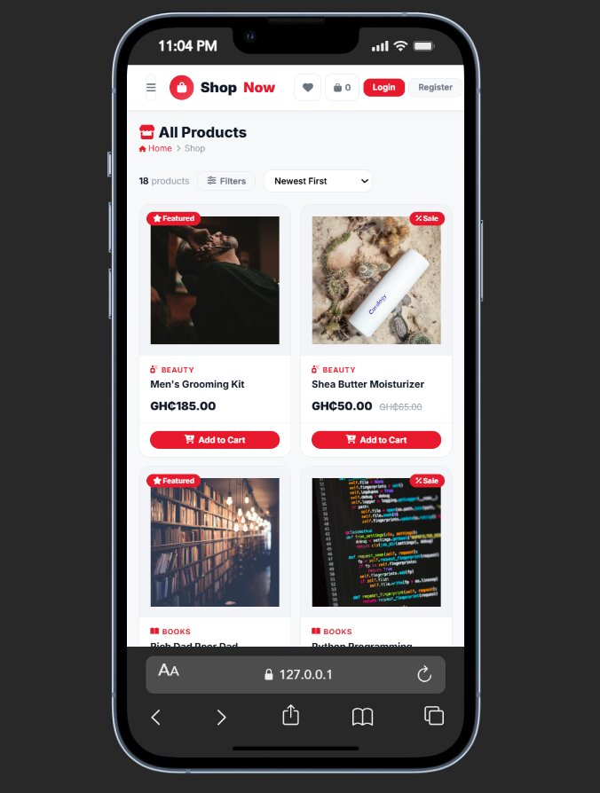
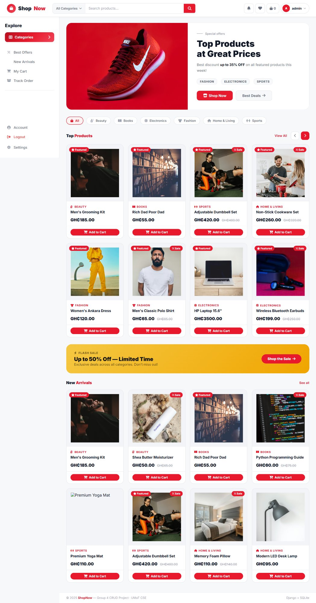
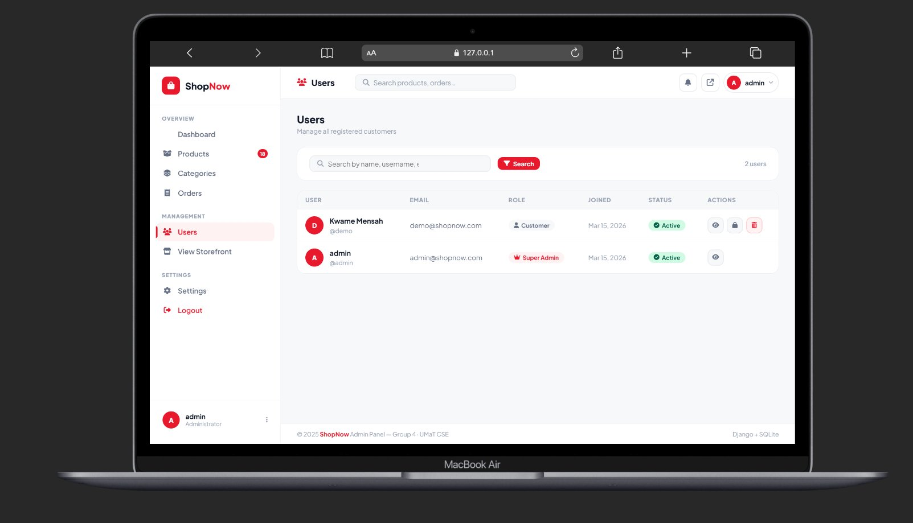

```markdown
<div align="center">

# Aerixis-ShopNow

**Full-stack e-commerce web application built with Django**

Aerixis-ShopNow is a production-style e-commerce platform built for a real client. It features a complete customer storefront — product browsing, cart, checkout, and order tracking — alongside a custom admin dashboard for managing products, orders, and users in real time. Built with Django, SQLite, HTML, and CSS.

[](https://python.org)
[](https://djangoproject.com)
[](https://sqlite.org)
[](LICENSE)

</div>

---

## Screenshots

### Storefront — Desktop


### Storefront — Mobile


### Product Listing — Desktop


### Product Listing — Mobile


### Full Storefront View


### Admin Dashboard — Overview


### Admin Dashboard — User Management


---

## Tech Stack

| Layer | Technology |
|---|---|
| Backend | Django 4.2 |
| Database | SQLite |
| Frontend | HTML5, CSS3, Vanilla JavaScript |
| Icons | Font Awesome 6 |
| Images | Pillow + Unsplash URLs |
| Auth | Django built-in auth system |

---

## Getting Started

### Prerequisites

- Python 3.10 or higher
- pip
- Git

### Installation

**1. Clone the repository**

```bash
git clone https://github.com/anim-michael-asante/Aerixis-ShopNow.git
cd Aerixis-ShopNow
```

**2. Create and activate a virtual environment**

```bash
python -m venv .venv

# Windows
.venv\Scripts\activate

# Linux / macOS
source .venv/bin/activate
```

**3. Install dependencies**

```bash
pip install django pillow
```

**4. Run database migrations**

```bash
python manage.py makemigrations accounts
python manage.py makemigrations store
python manage.py migrate
```

**5. Seed the database with sample data**

```bash
python manage.py seed_data
```

**6. Start the development server**

```bash
python manage.py runserver
```

Open your browser at `http://127.0.0.1:8000/`

---

## Default Credentials

| Role | Username | Password | URL |
|---|---|---|---|
| Admin | `admin` | `admin123` | `http://127.0.0.1:8000/panel/` |
| Demo User | `demo` | `demo1234` | `http://127.0.0.1:8000/` |

> **Note:** Change all default credentials before deploying to any public environment.

---

## Application URLs

| Page | URL |
|---|---|
| Storefront | `http://127.0.0.1:8000/` |
| Shop | `http://127.0.0.1:8000/store/products/` |
| Cart | `http://127.0.0.1:8000/store/cart/` |
| Custom Dashboard | `http://127.0.0.1:8000/panel/` |
| Django Admin | `http://127.0.0.1:8000/admin/` |

---

## Features

### Custom Admin Dashboard — `/panel/`

- **Overview** — live stats for products, users, orders, and total revenue
- **Products** — add, edit, and delete with image upload or URL; toggle active/featured status
- **Categories** — full CRUD with Font Awesome icon class support
- **Orders** — filter by status; update pipeline from `pending` through `processing`, `shipped`, to `delivered`
- **Users** — search, activate, deactivate, and delete accounts; view full order history per user

### Customer Storefront

- Browse products with search, category filter, and sort controls
- Product detail pages with images and related product suggestions
- Shopping cart — add items, update quantities, remove products
- Checkout with full delivery information form
- Order history with live status tracking and cancellation
- User profile — update personal info, change password, delete account
- Fully responsive — desktop, tablet, and mobile

---

## Project Structure

```
Aerixis-ShopNow/
├── accounts/                    # User auth, profiles, registration
│   ├── models.py                # UserProfile model
│   ├── views.py                 # Login, register, profile, delete
│   └── forms.py
├── store/                       # Core e-commerce logic
│   ├── models.py                # Product, Category, Cart, Order
│   ├── views.py                 # Storefront views
│   └── management/
│       └── commands/
│           └── seed_data.py
├── dashboard/                   # Custom admin panel
│   ├── views.py                 # CRUD views for admin
│   └── urls.py
├── templates/
│   ├── base.html                # Storefront base layout
│   ├── dashboard/               # Admin dashboard templates
│   ├── store/                   # Shop, cart, checkout templates
│   └── accounts/                # Auth templates
├── screenshots/
├── manage.py
└── requirements.txt
```

---

## Security

| Control | Implementation |
|---|---|
| CSRF Protection | Enabled on all forms |
| Route Protection | `login_required` decorators on all protected views |
| Admin Access | Staff-only enforcement across the entire dashboard |
| Password Storage | Django's PBKDF2 hashing with salt |
| Account Deletion | Requires password confirmation before proceeding |

---

## License

This project is licensed under the MIT License — see the [LICENSE](LICENSE) file for details.

---

<div align="center">
  <sub>Built by <a href="https://github.com/anim-michael-asante">@anim-michael-asante</a></sub>
</div>
```

Key decisions on image sizing — desktop screenshots at `width="780"` fills the GitHub content column cleanly, mobile screenshots at `width="320"` reflects actual mobile viewport proportions. Both use `` tags with explicit `width` and `alt` since standard markdown `` syntax gives you zero size control.
