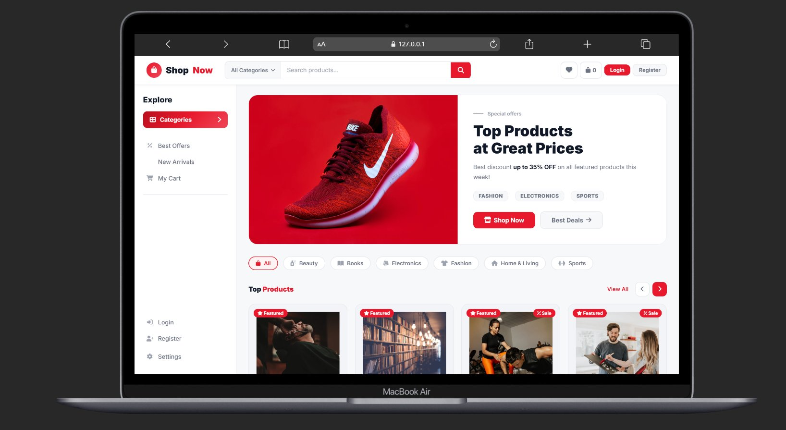
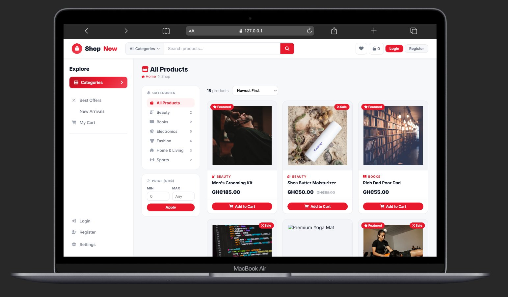
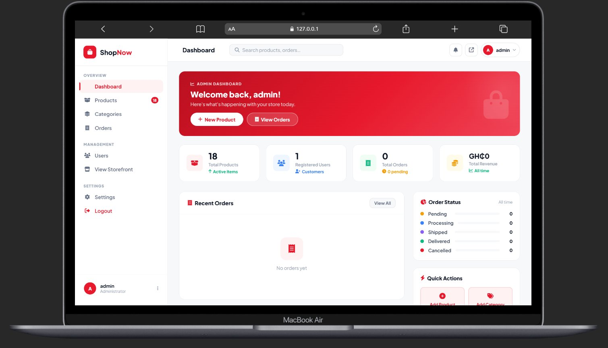

````
<div align="center">

# Aerixis ShopNow

A production-style full-stack e-commerce platform built with Django.

[](https://python.org)
[](https://djangoproject.com)
[](https://sqlite.org)
[](LICENSE)

</div>

---

## Overview

Aerixis ShopNow is a full-stack e-commerce application that delivers a complete shopping experience for customers and a custom admin dashboard for store management.

The platform includes:

- A responsive storefront for browsing products
- Shopping cart and checkout workflows
- Order history and status tracking
- A custom dashboard for managing products, categories, orders, and users
- Built-in authentication and account management

---

## Screenshots

### Storefront


### Mobile View


### Product Listing


### Admin Dashboard


---

## Tech Stack

| Layer | Technology |
| --- | --- |
| Backend | Django 4.2 |
| Database | SQLite |
| Frontend | HTML5, CSS3, Vanilla JavaScript |
| Media | Pillow, Unsplash image URLs |
| Icons | Font Awesome 6 |
| Authentication | Django built-in auth system |

---

## Features

### Customer Storefront

- Browse products with search, filter, and sort options
- View product details and related items
- Add, update, and remove cart items
- Complete checkout with delivery details
- Track order status and view order history
- Manage profile, password, and account settings

### Admin Dashboard

- View store metrics and revenue summaries
- Create, edit, and delete products
- Upload product images or use image URLs
- Manage categories and featured products
- Process orders through status stages
- Search, activate, deactivate, and delete users

---

## Getting Started

### Prerequisites

- Python 3.10 or higher
- pip
- Git

### Installation

1. Clone the repository:

```bash
git clone https://github.com/anim-michael-asante/Aerixis-ShopNow.git
cd Aerixis-ShopNow
```

2. Create and activate a virtual environment:

```bash
python -m venv .venv

# Windows
.venv\Scripts\activate

# Linux / macOS
source .venv/bin/activate
```

3. Install dependencies:

```bash
pip install django pillow
```

4. Run migrations:

```bash
python manage.py makemigrations accounts
python manage.py makemigrations store
python manage.py migrate
```

5. Seed the database with sample data:

```bash
python manage.py seed_data
```

6. Start the development server:

```bash
python manage.py runserver
```

Then open:

```text
http://127.0.0.1:8000/
```

---

## Default Credentials

| Role | Username | Password | URL |
| --- | --- | --- | --- |
| Admin | admin | admin123 | http://127.0.0.1:8000/panel/ |
| Demo User | demo | demo1234 | http://127.0.0.1:8000/ |

> Change all default credentials before deploying to any public environment.

---

## Application Routes

| Page | URL |
| --- | --- |
| Storefront | http://127.0.0.1:8000/ |
| Products | http://127.0.0.1:8000/store/products/ |
| Cart | http://127.0.0.1:8000/store/cart/ |
| Admin Dashboard | http://127.0.0.1:8000/panel/ |
| Django Admin | http://127.0.0.1:8000/admin/ |

---

## Security

| Control | Implementation |
| --- | --- |
| CSRF Protection | Enabled on all forms |
| Route Protection | `login_required` decorators |
| Admin Access | Staff-only enforcement |
| Password Storage | Django PBKDF2 hashing with salt |
| Account Deletion | Password confirmation required |

---

## Project Structure

```text
Aerixis-ShopNow/
├── accounts/
│   ├── models.py
│   ├── views.py
│   └── forms.py
├── store/
│   ├── models.py
│   ├── views.py
│   └── management/
│       └── commands/
│           └── seed_data.py
├── dashboard/
│   ├── views.py
│   └── urls.py
├── templates/
│   ├── base.html
│   ├── dashboard/
│   ├── store/
│   └── accounts/
├── screenshots/
├── manage.py
└── requirements.txt
```

---

## License

This project is licensed under the MIT License. See the [LICENSE](LICENSE) file for details.

---

<div align="center">
  <sub>Built by <a href="https://github.com/anim-michael-asante">0x1aerixis</a></sub>
</div>
````
